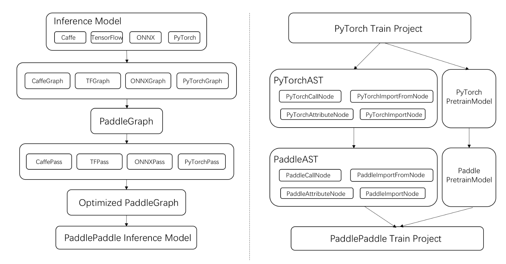

# X2Paddle
[](LICENSE)
[](https://github.com/PaddlePaddle/X2Paddle/releases)
  

## 简介
X2Paddle用于不同框架模型或项目到PaddlePaddle框架模型或项目的迁移，旨在为飞桨开发者提升框架间迁移的效率。  
X2Paddle支持Caffe/TensorFlow/ONNX/PyTorch的预测模型，一步转换至PaddlePaddle预测模型；同时，支持PyTorch训练项目，转换至PaddlePaddle项目，助力用户在PaddlePaddlePaddle上进行模型训练。

### 架构设计
X2Paddle的架构设计着重考虑了对多深度学习框架的的支持以及代码的易读性、易扩展性，并且在多个层面的对转换后OP进行优化处理。  


### 特性

- **支持主流深度学习框架**：目前已经支持Caffe/TensorFlow/ONNX/PyTorch四大框架的迁移，涵盖目前市面主流深度学习框架。  

- **支持的模型丰富**：在主流的CV和NLP模型上均支持转换，涵盖了19+个Caffe模型转换、27+个TensorFlow模型转换、32+个ONNX模型转换、27+个PyTorch模型转换、2+个PyTorch项目转换。  

- **简洁易用**：一条命令行或者一个API即可完成模型转换。  


## 环境依赖

- python >= 3.5  
- paddlepaddle >= 2.0.0

**按需安装以下依赖**  
- tensorflow ： tensorflow == 1.14.0  
- caffe ： 无  
- onnx ： onnx >= 1.6.0  
- pytorch：torch >=1.5.0 (script方式暂不支持1.7.0)

## 安装
### 方式一：源码安装（推荐）
```
git clone https://github.com/PaddlePaddle/X2Paddle.git
cd X2Paddle
git checkout develop
python setup.py install
```

### 方式二：pip安装
我们会定期更新pip源上的x2paddle版本
```
pip install x2paddle --index https://pypi.python.org/simple/
```
## 快速开始
### 预测模型转换
| 参数                 |        作用                                                      |
| -------------------- | ------------------------------------------------------------ |
| --framework          | 源模型类型 (tensorflow、caffe、onnx)                         |
| --prototxt           | 当framework为caffe时，该参数指定caffe模型的proto文件路径     |
| --weight             | 当framework为caffe时，该参数指定caffe模型的参数文件路径      |
| --save_dir           | 指定转换后的模型保存目录路径                                 |
| --model              | 当framework为tensorflow/onnx时，该参数指定tensorflow的pb模型文件或onnx模型路径 |
| --caffe_proto        | **[可选]** 由caffe.proto编译成caffe_pb2.py文件的存放路径，当存在自定义Layer时使用，默认为None |
| --define_input_shape | **[可选]** For TensorFlow, 当指定该参数时，强制用户输入每个Placeholder的shape，见[文档Q2](./docs/user_guides/FAQ.md) |
| --paddle_type        | **[可选]** 该参数指定转换为动态图代码（dygraph）或者静态图代码（static），默认为dygraph |

#### TensorFlow
```
x2paddle --framework=tensorflow --model=tf_model.pb --save_dir=pd_model --paddle_type dygraph
```
#### Caffe
```
x2paddle --framework=caffe --prototxt=deploy.prototxt --weight=deploy.caffemodel --save_dir=pd_model --paddle_type dygraph
```
#### ONNX
```
x2paddle --framework=onnx --model=onnx_model.onnx --save_dir=pd_model --paddle_type dygraph
```

#### PyTorch
PyTorch仅支持API使用方式，详见[PyTorch预测模型转换文档](./docs/user_guides/pytorch2paddle.md)。

### 训练项目转换

#### PyTorch
【待更新】可安装[分支](https://github.com/PaddlePaddle/X2Paddle/tree/pytorch_project_convertor)源码进行使用。
详见[PyTorch训练项目转换文档](https://github.com/SunAhong1993/X2Paddle/blob/code_convert_last/docs/pytorch_project_convertor/README.md)。


## 小工具
X2Paddle提供了工具解决如下问题，详见[tools/README.md](tools/README.md)  
1. 检测模型是否在PaddleLite中支持  
2. 合并模型参数文件


## 使用相关文档
1. [X2Paddle使用过程中常见问题](./docs/user_guides/FAQ.md)  
2. [如何导出TensorFlow的Frozen Model](./docs/user_guides/export_tf_model.md)
3. [PyTorch模型导出为ONNX模型](./docs/user_guides/pytorch2onnx.md)
4. [X2Paddle添加内置的Caffe自定义层](./docs/user_guides/add_caffe_custom_layer.md)
5. [转换后PaddlePaddle预测模型简介](./docs/user_guides/pd_folder_introduction.py)
6. [Paddle到ONNX的转换](https://github.com/PaddlePaddle/Paddle2ONNX)

## 支持列表文档
1. [X2Paddle测试模型库](./docs/introduction/x2paddle_model_zoo.md)  
2. [X2Paddle支持的op列表](./docs/introduction/op_list.md)


## 转换教程
1. [TensorFlow预测模型转换教程](./docs/demo/tensorflow2paddle.ipynb)
2. [PyTorch预测模型转换教程](./docs/demo/pytorch2paddle.ipynb)

## 更新历史
2020.12.09
1. 新增PyTorch2Paddle转换方式，转换得到Paddle动态图代码，并动转静获得inference_model。
  方式一：trace方式，转换后的代码有模块划分，每个模块的功能与PyTorch相同。
  方式二：script方式，转换后的代码按执行顺序逐行出现。
2. 新增Caffe/ONNX/Tensorflow到Paddle动态图的转换。
3. 新增TensorFlow op（14个）：Neg、Greater、FloorMod、LogicalAdd、Prd、Equal、Conv3D、Ceil、AddN、DivNoNan、Where、MirrorPad、Size、TopKv2
4. 新增Optimizer模块，主要包括op融合、op消除功能，转换后的代码可读性更强，进行预测时耗时更短。


## 贡献代码

我们非常欢迎您为X2Paddle贡献代码或者提供使用建议。如果您可以修复某个issue或者增加一个新功能，欢迎给我们提交Pull Requests。
